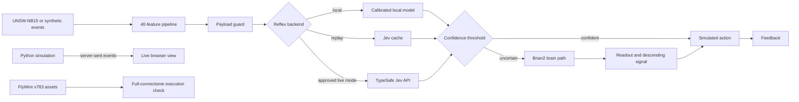

# Drosophila Sentinel

`drosophila-sentinel` is a defensive cyber-range that compares a typed reflex
decision path with a Brian2 leaky integrate-and-fire network inspired by the
adult fruit-fly connectome. Hosts, attacks, telemetry, and defensive actions are
Python objects. The project never scans, exploits, isolates, or changes real
systems.

The repository contains working paths for public UNSW-NB15 V3 preprocessing,
local and live Jev decisions, synthetic-connectome experiments, a full FlyWire
v783 execution check, held-out attack-family evaluation, and a live browser
visualization driven by Python simulation events.

The engineering pipeline works, but the scientific result is negative. The
connectome-derived B2 through B5 arms issued no actions and did not outperform
shuffled or random controls. This project does not claim that a fly connectome
improves intrusion detection.

## How it works



The default workflow is offline. Only
`src/sentinel/jev/typesafe_backend.py` can make runtime HTTP requests. The live
visualization binds to `127.0.0.1`, receives each event as Python computes it,
and never calls Jev.

## Measured results

### Full FlyWire execution

- 138,639 neurons
- 15,091,983 directed connections
- 5 ms deterministic simulation
- 1.134 seconds elapsed
- 9 spikes across 9 neurons

This is an execution check, not evidence of detection quality or biological
validity.

### Held-out UNSW-NB15 evaluation

- 2,754,739 source rows scanned
- 5,174 records retained by deterministic family-capped sampling
- 3,750 training records
- 1,250 validation records
- 174 held-out Worms records
- 100% simulated pipeline action rate on the malicious-only test set
- 98.28% IsolationForest/autoencoder baseline detection
- 8.98 ms mean pipeline latency
- 9.94 ms p95 pipeline latency

The held-out set contains only malicious Worms records, so it cannot measure a
false-action rate.

### Live Jev calibration

The completed calibration used 400 balanced UNSW records. Across two attempts,
401 live requests used 504,012 input tokens. Successful parsed responses cost
$0.021116046. Including the inferred cost of the failed parsed response, the
total was $0.021168504.

| Metric | Result |
| --- | ---: |
| Brier score | 0.3113115 |
| ECE, 10 bins | 0.2325 |
| Mean latency | 581.63 ms |
| p50 latency | 506.85 ms |
| p95 latency | 832.96 ms |
| p99 latency | 1,700.07 ms |

Ten vendor responses had rounded choice probabilities summing to 0.99. The
parser normalizes only sums in the inclusive range `[0.98, 1.02]`. The original
response, normalized response, correction factor, and question name remain in
the local cache record. The strict `1e-6` schema validation remains unchanged.

## Requirements

- Linux x86-64
- Python 3.11
- `uv`
- A modern browser for the live visualization
- Enough disk space for the offline wheelhouse and optional engineering assets

The full-FlyWire run completed on a host with 15 GiB visible RAM. Peak memory
was not measured.

## Setup

Clone the repository and enter it:

```bash
git clone git@github.com:Manav12-12/no-brainer.git
cd no-brainer
```

Download pinned runtime files while network access is allowed:

```bash
./scripts/fetch_offline_assets.sh --runtime-only
```

Download the optional FlyWire and UNSW-NB15 assets if you want to run the full
engineering paths:

```bash
./scripts/fetch_offline_assets.sh --engineering-assets
```

Create the environment entirely from the downloaded wheelhouse:

```bash
make setup
```

`make setup` creates `.venv`, installs pinned packages without an index,
verifies available manifests, and runs the offline smoke test.

## Run the live simulation

```bash
make live
```

The command opens `http://127.0.0.1:8765`. Python fits the local reflex model,
runs the cyber-range, and executes Brian2 one event at a time. Each completed
event streams directly to the browser. The display shows:

- optic lobes, central brain volume, mushroom bodies, and central complex;
- the descending pathway and segmented ventral nerve cord;
- measured Brian2 spikes and active synthetic-connectome nodes;
- attack targets, compromised hosts, and simulated isolation actions;
- live compute time, confidence, spike count, and neural readout; and
- stream progress and renderer frame rate.

The visualization uses a 48-node synthetic connectome proxy so it can run
interactively. The anatomy is stylized and is not a reconstruction of the full
FlyWire brain.

Use **New live run** to restart Python computation. Use **Fullscreen** for a
clean capture. **Record WebM** starts a new live run and records the 1920 by 1080
canvas at 30 FPS. Click **Stop + save** to download the recording.

Convert the WebM to an MP4 for platforms that require it:

```bash
ffmpeg -i drosophila-sentinel-live.webm -c:v libx264 \
  -pix_fmt yuv420p -movflags +faststart drosophila-sentinel-live.mp4
```

Press `Ctrl+C` in the terminal to stop the local server.

## Run the engineering paths

Run the deterministic synthetic experiment replay:

```bash
make jev-plan
make experiments
```

Run the full FlyWire execution check:

```bash
make fullbrain
```

Prepare and evaluate public UNSW-NB15 V3 data:

```bash
make public-data
```

Inspect the offline live-call plan without making requests:

```bash
make jev-calibration-plan
```

Do not run `make jev-calibrate` without approving a new call and cost budget.
The documented calibration budget has already been spent.

## Jev credentials

The client reads `TYPESAFE_API_KEY` only from the process environment. Never
store a key in `.env`, configuration, scripts, logs, or repository files.

For an explicitly approved live contract check:

```bash
read -rsp 'TypeSafe key: ' TYPESAFE_API_KEY
export TYPESAFE_API_KEY
make jev-check
unset TYPESAFE_API_KEY
```

The model is pinned to `jev-1.13.0`. Moving aliases and responses from another
model version are rejected.

## Verification

```bash
make lint
make typecheck
make test
.venv/bin/python -m bandit -c pyproject.toml -r src
.venv/bin/python -m detect_secrets scan --baseline .secrets.baseline
.venv/bin/python scripts/verify_manifest.py
```

The final verification passed Ruff, strict mypy, 56 tests, Bandit,
detect-secrets, and manifest verification. The test suite reached 88.40%
branch-aware coverage. The live dependency audit found no unsuppressed known
vulnerabilities. `PYSEC-2026-113` is suppressed because the reviewed advisory
states that the affected Arrow C++ API is not exposed by the Python binding used
here.

## Security properties

- Default tests block network sockets.
- Runtime egress is restricted to the pinned TypeSafe HTTPS endpoint.
- Live requests have a fixed call limit and calculated cost ceiling.
- Jev payloads omit labels, attack families, IP fields, timestamps, and source
  rows.
- Defensive actions modify in-memory simulated hosts only.
- SHA-256 manifests cover the wheelhouse, model source, full FlyWire assets,
  UNSW archive, and Jev cache when those files are present.
- The project does not load pickle files from the upstream model repository.

## Limitations

- The cyber-feature to neuron mapping is heuristic and has no established
  biological meaning.
- The full-brain result is a 5 ms execution check, not a detection benchmark.
- The public-data evaluation uses a deterministic family-capped academic sample,
  not operational traffic prevalence.
- Jev is a closed vendor model. Results apply only to `jev-1.13.0` and the tested
  400-record calibration set.
- Cached responses do not reflect future model or service changes.
- The configured 0.8 threshold produced no Jev reflex actions in calibration.
- B2 through B5 did not outperform shuffled or random controls. Whether a fly
  connectome can add security value remains unresolved.
