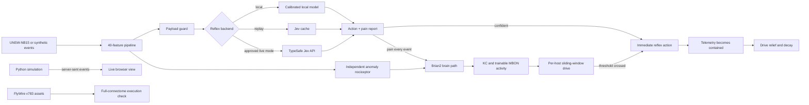

# Drosophila Sentinel

`drosophila-sentinel` is a defensive cyber-range that compares a typed reflex
decision path with a Brian2 leaky integrate-and-fire network inspired by the
adult fruit-fly connectome. Hosts, attacks, telemetry, and defensive actions are
Python objects. The project never scans, exploits, isolates, or changes real
systems.

The repository contains working paths for public UNSW-NB15 V3 preprocessing,
local and live Jev decisions, synthetic-connectome experiments, a full FlyWire
v783 execution check, held-out attack-family evaluation, and a live browser
visualization driven by Python simulation events.

The main result is a working closed loop. Sustained stimulation raises per-host
drive, the controller takes a simulated defensive action, the attacker enters
the `contained` state, and drive falls after relief. On 10 attack and 10 benign
synthetic validation episodes, this sequential controller detected every attack
episode, produced no benign-episode false actions, and contained attacks at mean
step 9.0.

That episode-level result is separate from record-level detection quality. On
the mixed benchmark, the combined system reached ROC-AUC 0.734 versus 0.725 for
the standard anomaly baseline, but its selected F1 was lower, 0.692 versus
0.712, with a 70% false-positive rate. Shuffled and random graph controls
matched or beat the intended topology. The project demonstrates an audited
control architecture, not a better detector or a fly-connectome advantage.

## How it works



The default workflow is offline. Only
`src/sentinel/jev/typesafe_backend.py` can make runtime HTTP requests. The live
visualization binds to `127.0.0.1`, receives each event as Python computes it,
and never calls Jev.

## Measured results

### Sequential closed-loop validation

| Metric | Result |
| --- | ---: |
| Attack episodes detected | 10/10 |
| Benign episodes with false actions | 0/10 |
| Mean containment step | 9.0 |
| Drive window | 3 events |
| Action threshold | 1.0 |

This is synthetic, episode-level validation of stimulus buildup, action,
containment, and relief. It is not the record-level mixed benchmark below.

The final audit also found an inverted pain-extraction score. Correcting it
raised validation ROC-AUC from 0.373 to 0.641.

### Historical pain-only closed-loop evaluation

Drive parameters were selected only on 20 validation episodes. The following
results use 10 fixed, disjoint evaluation seeds per arm:

| Arm | Episodes contained | False-action rate | Mean steps to contain | P95 |
| --- | ---: | ---: | ---: | ---: |
| B1 Jev replay | 0% | 0% | — | — |
| B2 trained proxy + drive | 100% | 0% | 5.1 | 6.0 |
| B3 Jev-to-brain + drive | 100% | 0% | 5.1 | 6.0 |
| B4 degree-preserving shuffle | 100% | 0% | 6.8 | 8.0 |
| B5 random sparse graph | 100% | 0% | 7.5 | 8.55 |
| B6 local baseline | 100% | 2.11% | 2.1 | 2.55 |

B2–B5 each issued one drive action per episode. B6 was faster but issued 200
actions and caused eight benign-host injuries across its 10 episodes. B4 and
B5 remain honest controls: their comparable containment means these results do
not establish a FlyWire-specific benefit. See `docs/RESULTS.md` for definitions
and limitations.

### Mixed detection-quality evaluation

| Method | F1 | FPR | ROC-AUC | PR-AUC |
| --- | ---: | ---: | ---: | ---: |
| Jev reflex | 0.681 | 0.820 | 0.651 | 0.635 |
| Brain/drive, pain only | 0.669 | 0.950 | 0.645 | 0.640 |
| Combined Jev + B6 + brain | 0.692 | 0.700 | 0.734 | 0.728 |
| B4 shuffled | 0.695 | 0.670 | 0.738 | 0.742 |
| B5 random | 0.717 | 0.630 | 0.749 | 0.754 |
| B6 baseline | 0.712 | 0.720 | 0.725 | 0.725 |

The combined system ranks slightly better than B6 but has lower selected F1.
B4/B5 perform better than the intended graph, and all selected operating points
have excessive false positives. In the separate synthetic sequential test,
dual-input drive tuning reached 100% episode detection with no benign-episode
false actions and mean containment step 9.0.

### Live drive proof

The recorded browser run is driven by real Python state, not a prerecorded or
JavaScript-generated drive trace:

- [MP4 proof clip](docs/assets/drosophila-sentinel-drive-cycle.mp4)
- [WebM source capture](docs/assets/drosophila-sentinel-drive-cycle.webm)
- [action/relief frame](docs/assets/drive-action-relief.png)

### Full FlyWire execution

- 138,639 neurons
- 15,091,983 directed connections
- 5 ms deterministic simulation
- 1.134 seconds elapsed
- 9 spikes across 9 neurons

This is an execution check, not evidence of detection quality or biological
validity.

### Held-out UNSW-NB15 evaluation

- 2,754,739 source rows scanned
- 5,174 records retained by deterministic family-capped sampling
- 3,750 training records
- 1,250 validation records
- 174 held-out Worms records
- 100% simulated pipeline action rate on the malicious-only test set
- 98.28% IsolationForest/autoencoder baseline detection
- 356.04 ms mean pipeline latency
- 401.00 ms p95 pipeline latency

The held-out set contains only malicious Worms records, so it cannot measure a
false-action rate.

### Live Jev calibration

The completed calibration used 400 balanced UNSW records. Across two attempts,
401 live requests used 504,012 input tokens. Successful parsed responses cost
$0.021116046. Including the inferred cost of the failed parsed response, the
total was $0.021168504.

| Metric | Result |
| --- | ---: |
| Brier score | 0.3113115 |
| ECE, 10 bins | 0.2325 |
| Mean latency | 581.63 ms |
| p50 latency | 506.85 ms |
| p95 latency | 832.96 ms |
| p99 latency | 1,700.07 ms |

Ten vendor responses had rounded choice probabilities summing to 0.99. The
parser normalizes only sums in the inclusive range `[0.98, 1.02]`. The original
response, normalized response, correction factor, and question name remain in
the local cache record. The strict `1e-6` schema validation remains unchanged.

## Requirements

- Linux x86-64
- Python 3.11
- `uv`
- A modern browser for the live visualization
- Enough disk space for the offline wheelhouse and optional engineering assets

The full-FlyWire run completed on a host with 15 GiB visible RAM. Peak memory
was not measured.

## Setup

Clone the repository and enter it:

```bash
git clone git@github.com:Manav12-12/no-brainer.git
cd no-brainer
```

Download pinned runtime files while network access is allowed:

```bash
./scripts/fetch_offline_assets.sh --runtime-only
```

Download the optional FlyWire and UNSW-NB15 assets if you want to run the full
engineering paths:

```bash
./scripts/fetch_offline_assets.sh --engineering-assets
```

Create the environment entirely from the downloaded wheelhouse:

```bash
make setup
```

`make setup` creates `.venv`, installs pinned packages without an index,
verifies available manifests, and runs the offline smoke test.

## Run the live simulation

For the shortest demo path after setup:

```bash
make live
```

The command opens `http://127.0.0.1:8765`. Python fits the local reflex model,
trains KC-to-MBON weights, runs the cyber-range, and executes Brian2 one event
at a time. Each completed event streams directly to the browser. No API key or
live Jev call is required.

During the demo, watch the `HOMEOSTATIC DRIVE` bar. It accumulates stimulation
for each host, crosses the configured threshold, triggers a simulated action,
and drops after relief. Click `New live run` to restart with the same
deterministic seed. The display also shows:

- optic lobes, central brain volume, mushroom bodies, and central complex;
- the descending pathway and segmented ventral nerve cord;
- measured Brian2 spikes and active synthetic-connectome nodes;
- attack targets, compromised hosts, and simulated isolation actions;
- live per-host drive buildup, threshold crossing, action, and relief;
- compute time, confidence, spike count, and neural readout; and
- stream progress and renderer frame rate.

The visualization uses a 48-node synthetic connectome proxy so it can run
interactively. The anatomy is stylized and is not a reconstruction of the full
FlyWire brain.

Use **New live run** to restart Python computation. Use **Fullscreen** for a
clean capture. **Record WebM** starts a new live run and records the 1920 by 1080
canvas at 30 FPS. Click **Stop + save** to download the recording.

Convert the WebM to an MP4 for platforms that require it:

```bash
ffmpeg -i drosophila-sentinel-live.webm -c:v libx264 \
  -pix_fmt yuv420p -movflags +faststart drosophila-sentinel-live.mp4
```

Press `Ctrl+C` in the terminal to stop the local server.

If port 8765 is occupied, run:

```bash
PYTHONPATH=src .venv/bin/python scripts/run_live_simulation.py --port 8877
```

## Run the engineering paths

Run the deterministic synthetic experiment replay:

```bash
make jev-plan
make experiments
```

Run the full FlyWire execution check:

```bash
make fullbrain
```

Prepare and evaluate public UNSW-NB15 V3 data:

```bash
make public-data
```

Inspect the offline live-call plan without making requests:

```bash
make jev-calibration-plan
```

Do not run `make jev-calibrate` without approving a new call and cost budget.
The documented calibration budget has already been spent.

## Jev credentials

The client reads `TYPESAFE_API_KEY` only from the process environment. Never
store a key in `.env`, configuration, scripts, logs, or repository files.

For an explicitly approved live contract check:

```bash
read -rsp 'TypeSafe key: ' TYPESAFE_API_KEY
export TYPESAFE_API_KEY
make jev-check
unset TYPESAFE_API_KEY
```

The model is pinned to `jev-1.13.0`. Moving aliases and responses from another
model version are rejected.

## Verification

```bash
make lint
make typecheck
make test
.venv/bin/python -m bandit -c pyproject.toml -r src
.venv/bin/python -m detect_secrets scan --baseline .secrets.baseline
.venv/bin/python scripts/verify_manifest.py
```

The final verification passed Ruff, strict mypy, 60 tests, Bandit,
detect-secrets, and manifest verification. The test suite reached 88.85%
branch-aware coverage. The live dependency audit found no unsuppressed known
vulnerabilities. `PYSEC-2026-113` is suppressed because the reviewed advisory
states that the affected Arrow C++ API is not exposed by the Python binding used
here.

## Security properties

- Default tests block network sockets.
- Runtime egress is restricted to the pinned TypeSafe HTTPS endpoint.
- Live requests have a fixed call limit and calculated cost ceiling.
- Jev payloads omit labels, attack families, IP fields, timestamps, and source
  rows.
- Defensive actions modify in-memory simulated hosts only.
- SHA-256 manifests cover the wheelhouse, model source, full FlyWire assets,
  UNSW archive, and Jev cache when those files are present.
- The project does not load pickle files from the upstream model repository.

## Limitations

- The cyber-feature to neuron mapping is heuristic and has no established
  biological meaning.
- The full-brain result is a 5 ms execution check, not a detection benchmark.
- The public-data evaluation uses a deterministic family-capped academic sample,
  not operational traffic prevalence.
- Jev is a closed vendor model. Results apply only to `jev-1.13.0` and the tested
  400-record calibration set.
- Cached responses do not reflect future model or service changes.
- The Jev gate is an empirical operating point for the cached `jev-1.13.0`
  distribution. Its locked cache partition detected 7% with 0% false actions.
- The 48-node graph is an engineering proxy. Its aggregate edge weight is based
  on a FlyWire asset statistic, not identified biological ORN/PN pathways.
- Shuffled and random controls consistently matched or outperformed the intended
  topology. The completed experiments show no connectome-specific benefit.
- KC-to-MBON learning added about 0.008 validation ROC-AUC over the untrained
  dual-input graph. Most combined value came from the anomaly input.
- The mixed partition had prior aggregate gate reporting, and its host roles and
  segments are synthetic. It is not pristine operational traffic.
- The semantically named Jev payload remains unmeasured because it has no cache
  coverage and requires new authenticated calls.
