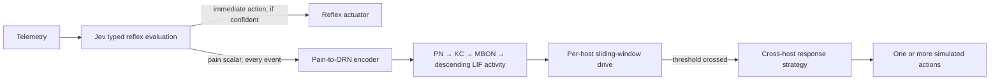

# Engineering audit trail

## Jev reflex gate

The original reflex gate assumed that the `known_pattern` `noul` score was a
calibrated probability with a natural cutoff of 0.5. Jev 1.13.0 did not use
that range on the cached UNSW sample: all 400 scores were between 0.20 and
0.38, and the combined reflex confidence never exceeded 0.60. Consequently,
the former `known >= 0.5` and `confidence >= 0.8` gate could not fire.

No independent cached Jev validation run exists, and a new paid/network call
was not authorized. `scripts/tune_jev_gate.py` therefore makes a deterministic,
attack-family-stratified 50/50 partition of the existing cache. It tunes only
on the validation partition, maximizing detection subject to a 5% validation
false-action cap, and evaluates once on the other partition. This is weaker
than a genuinely independent validation run because Phase 1 already reported
aggregate statistics for all 400 records; the limitation is explicit rather
than hidden.

The selected gate is:

- `known_pattern >= 0.27`
- combined reflex confidence `>= 0.28`
- Jev must select a non-`no_op` closed-set action

Operational values live in `configs/jev.yaml`. The known-pattern boundary is
an empirical Jev 1.13.0 operating point, not a universal interpretation of a
`noul` score and not a claim that Jev is well calibrated.

## Synthetic-brain propagation

The original 48-node proxy gave each PN one ORN input with connectivity 4,
equivalent to 1.1 mV under the published 0.275 mV/contact model constant. No
PN spiked in held-out traffic or in maximal-input probes as long as 1 second.

The local FlyWire v783 connectivity asset was measured before changing the
proxy. Across excitatory edges, the 99th percentile is 31 contacts; median
excitatory in-degree is 37 edges. The reduced graph cannot preserve that
in-degree with its former one-to-one feed-forward layers. It now uses complete
feed-forward connections and treats each proxy edge as an aggregate bundle of
31 contacts. This is a clearly labeled engineering proxy derived from the
asset distribution, not a claim about identified ORN or PN neurons in
FlyWire. The membrane constants and 0.275 mV/contact value remain unchanged
and retain their citations in `configs/brain_mb_subnet.yaml`.

`scripts/run_reachability_probe.py` records the FlyWire measurements and 100
maximal-input runs at 15, 20, 50, and 100 ms in
`artifacts/brain-reachability.json`. Interactive and evaluation paths use the
configured 50 ms duration rather than their former inconsistent 15/20 ms
hard-coded durations.

## Offline KC-to-MBON learning

The original `offline_kc_mbon_update()` was reachable only from tests. Its
returned array was never copied into graph or Brian2 weights. Evaluation was
therefore always static despite the presence of feedback-related modules.

`train_kc_mbon_weights()` now runs a bounded offline training phase and writes
each updated KC-to-MBON value back to the graph edge attribute consumed by the
next `simulate_lif()` call. The teaching signal is a reward-prediction error:
the binary training label minus normalized MBON activity. Missing edges in
shuffled/random controls remain missing; learning does not repair topology.
Weights are clipped to positive proxy-connectivity bounds `[0.1, 100]`.

Synthetic and public-data evaluations train on a deterministic balanced batch
of 32 training records. Evaluation is explicitly labeled `trained`; there is
no ambiguous implicit/static mode. The 0.05 learning rate is an engineering
choice, and no claim is made that this is a biological learning rule.

## Homeostatic drive

The controller maintains persistent pressure independently for each host.
Every event contributes stimulation derived from Jev pain, an independent
statistical anomaly channel, propagated KC activity, and MBON readout. A three-event
sliding window feeds a leaky accumulator. An isolation action fires at the
configured threshold, immediately reduces drive to 15% of its pre-action
value, and clears the stimulation window. Isolation changes the cyber-range
state; the attacker then emits `contained` telemetry with no attack offset, so
subsequent observations continue to reduce drive through decay rather than
depending only on the immediate reset.

The original pain-only validation selected window 3, decay 0.82, stimulation
floor 0.15, and threshold 0.4. Once the independent anomaly channel was added,
the same validation-only search selected window 3, decay 0.75, stimulation
floor 0.25, and threshold 1.0 under the precommitted 5% false-action cap. It
reached 100% episode detection, 0% benign-episode false actions, and mean
containment step 9.0. `artifacts/drive-validation.json` records the selection;
held-out seeds were not used.

## Reflex-to-brain causal architecture

The former controller treated Jev and the brain as mutually exclusive paths:
a confident reflex bypassed the brain, while an uncertain event caused the
brain to rescore the original 40 telemetry features. That did not model a
reflex arc and created two disconnected perceptions of the same event.

`evaluate_reflex()` now emits a bounded pain scalar for every valid response,
including responses that trigger an immediate reflex action. The scalar is the
validation-selected mean of action confidence and one minus known-threat
probability. The prior formula ranked attacks below benign records (ROC-AUC
0.373); the revised extraction reached 0.641 on validation. An unavailable backend emits an explicit zero with
`available=False`; it never causes an HTTP fallback or invented classification.

The immediate reflex and upstream pain report are independent. Every event in
the combined path maps pain directly to ORN rates, propagates it through the
LIF network, and updates per-host drive. Raw telemetry is no longer passed to
the brain by the orchestrator. Once drive crosses threshold, the brain selects
a response strategy from sustained and cross-host state. Available strategies
include host containment, escalation from a narrower reflex to isolation, and
coordinated isolation/rate-limiting for correlated hosts in one segment.

## Detection-quality evaluation

The mixed benchmark is the locked half of the 400-record Jev cache: 100 benign
and 100 malicious records. All cached rows are excluded from B6 training. The
other cache half is used for score scaling, KC-to-MBON training, and threshold
selection. Exact thresholds and curves are in
`artifacts/detection-quality.json`.

The v1 serializer retains the permitted numeric values but removes their source
names and supplies synthetic context. A semantic v2 candidate has zero cache
hits and requires 200 new authenticated validation calls. Because no credential
was available, it remains unmeasured and was not promoted into production.

The combined graph slightly exceeds B6's held-out ROC/PR ranking but has lower
F1 at its selected threshold. Shuffled and random graphs perform better than
the intended graph. False-positive rates remain high, and no topology-specific
or deployment-quality claim is supported.
